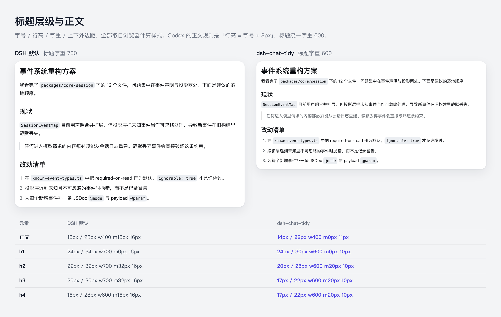
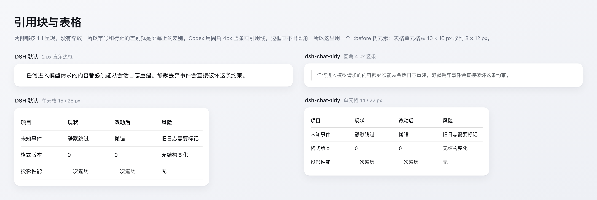

# Tidy Chat design

## Objective

Make the DSH Web conversation read like a mature coding-agent client. Codex is the single target: every metric below is measured from it, not invented. Nothing about the chat renderer, information semantics, or color palette changes.

The defect being corrected is the article-like scale applied inside a high-frequency work surface: DSH renders 16 px body on 28 px leading with 32 px heading margins and 16 px block gaps, so visual volume swings sharply from one model response to another.

## Measurement method

Two independent readings were taken and agreed:

1. The Codex desktop app's bundled stylesheets, extracted from `ChatGPT.app`'s `app.asar` (`app-*.css`).
2. Pixel measurement of a live Codex window (2× retina screenshot, ink-row/column profiling to recover line pitch and box edges).

## Codex versus DSH

| Item | DSH default | Codex measured | Tidy Chat applies |
| --- | --- | --- | --- |
| Body | 16 / 28 px (1.75) | 14 / 22 px, rule `font-size + 8px` | 14 / 22 px |
| h1 | 24 / 34 px, weight 700 | 24 / 30 px (`line-height: 1.25`), weight 600 | 24 / 30 px, weight 600 |
| h2 | 22 / 32 px, weight 700 | 20 / 25 px, weight 600 | 20 / 25 px, weight 600 |
| h3, h4 | 20 / 30 px, 16 / 28 px | 17 / 22 px both | 17 / 22 px both |
| h5, h6 | 16 / 28 px | 15 / 20 px | 15 / 20 px |
| Heading margin | 32 px / 16 px | 20 px / 10 px | 20 px / 10 px |
| Paragraph | `margin: 16px 0` | `margin: 0 0 11px` (.6875rem) | `margin: 0 0 11px` |
| List indent | 18 px | 21 px (1.3125rem) | 21 px |
| List item gap | 6 px | 8 px (.5rem) | 8 px |
| List block margin | 16 px | 10 px (.625rem) | 10 px |
| `hr` | 32 px | 28 px | 28 px |
| Blockquote | 2 px square border, 14 px inset | rounded 4 px bar (radius 2 px), 24 px inset | rounded 4 px bar, 18 px inset |
| Inline code | radius 6 px, padding 0 5px | radius 6 px, padding 1px 6px, `box-decoration-break: clone` | padding and clone only |
| Table cells | 15 / 25 px tokens, 10 × 16 px | fixed 14 px | 14 / 22 px, 8 × 12 px |
| Content width | 748 px | ≈730 px | unchanged at 748 px |

Two deliberate divergences: inline-code `font-size` is left alone because DSH sets `0.875em !important` and an `!important` war is not worth a 0.045em difference; blockquote inset is 18 px rather than 24 px because DSH's quote text is not indented as deeply to begin with.

Codex additionally tightens the gap between adjacent Han-script paragraphs to 4 px. That rule is not reproduced: DSH's `index.html` pins `lang="zh-CN"` statically, so a `:lang()` guard would also fire on English responses.

The rightmost column is reproducible from the running app rather than from this table alone. The heading ladder and body text side by side, with the computed styles read from the live document:

The blockquote bar and the table cells, both panes drawn 1:1 so the visible size difference is the rendered one:

## Extension boundary

The browser bundle mounts one stylesheet. Its selectors target only:

- conversation-owned semantic `data-*` attributes;
- the slot renderer's stable `[data-slot]` anchor;
- semantic Markdown elements below an `assistant-step` row.

CSS-module hashes are never referenced. Because there is no plugin-owned body marker any more, each rule carries a leading `body` type selector: DSH's module rules such as `.markdown h1` score (0,1,1), and `body [data-chat-flow-kind='assistant-step'] h1` scores (0,1,2), so the plugin wins independently of injection order. `tests/styles.spec.ts` enforces that every anchored selector keeps the prefix.

The plugin does not register a keyed chat-node replacement or a `conversation.view`, because either would duplicate DSH's renderer and sever feature contributions added by other plugins.

## Lifecycle

The client mounts exactly one reference-counted `<style data-plugin="dsh-chat-tidy">`. Disposal removes the final reference and the element. There is no listener, no observer, and no timer.

## Configuration

None. Earlier releases shipped Balanced / Compact / Original modes; a mode switch implies the plugin is unsure what good looks like, and with a single measured target it is not. Disabling or uninstalling the plugin restores DSH defaults, which is what the Original mode did.

Consequently nothing is persisted, no locale namespace is registered, and no Settings row is contributed.

## Compatibility and failure mode

Rules use modern CSS already required by DSH's Chromium-class Web client, including `:has()`. A removed DSH semantic attribute produces an unmatched rule, not an exception. The plugin never uses a DOM observer, so a host DOM change cannot create a render loop or stale cloned node.

Token-based theme plugins are compatible. Layout plugins that set the same typography or chat-flow properties compete by definition; users should select one layout plugin.

## Non-goals

- Aggregating tool calls into a new synthetic "worked for" row.
- Hiding reasoning or context by default.
- Replacing the conversation header, sidebar, or editor layout.
- Changing Markdown structure or model prompting.
- Reproducing Codex's color palette, iconography, or chrome.

Those require product-level renderer or view contributions and should be evaluated separately from typography alignment.
