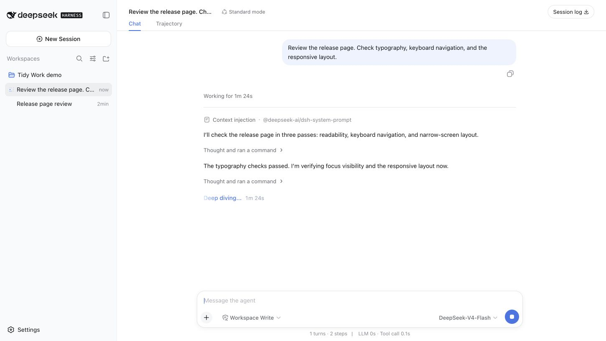
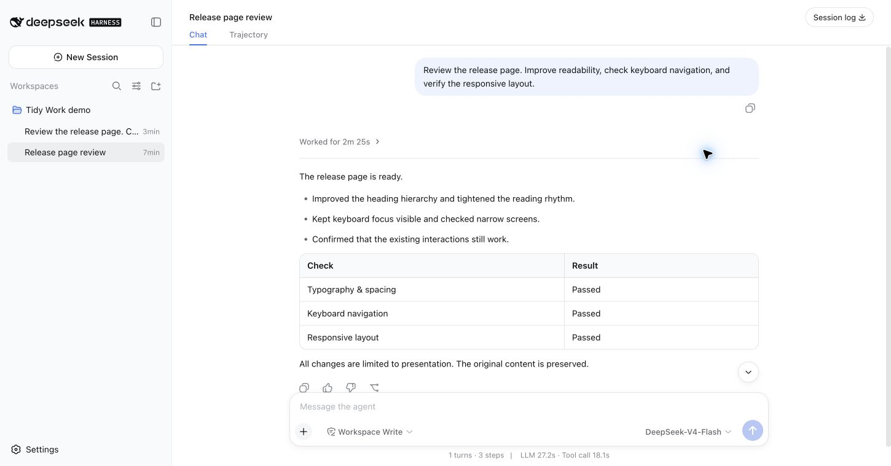
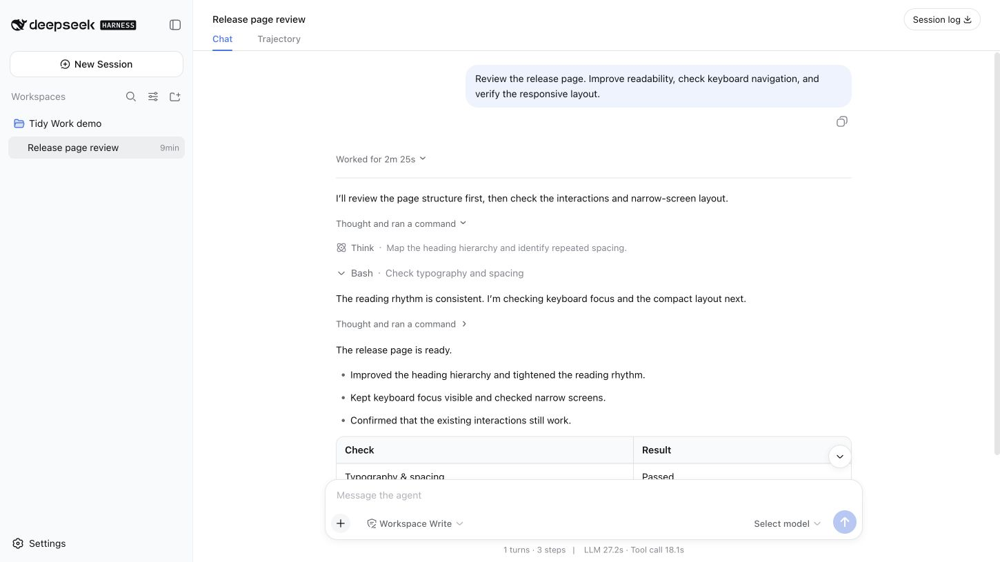

# dsh-chat-tidy

Keep the answer in view. Open the work when you need it.

Tidy Chat adds Codex-inspired work disclosure, live turn timing, compact typography, and polished Markdown tables to DeepSeek Harness Web. Your original reasoning and tool cards remain available, with their native interactions intact.

[简体中文](README.zh.md)

## Tidy Work · new in 0.4.0

- **While working:** a turn header shows “Working for …”. Progress commentary stays visible; consecutive reasoning and supported tool calls share an expandable activity summary.
- **When complete:** “Worked for …” folds the intermediate work and leaves the final answer visible. Expand the turn, then an activity group, then a native Think or tool card to inspect the original details.
- **When attention is needed:** failed tool calls, interrupted output, approval/question interfaces, unknown tools, and third-party content stay accessible. Only a normally completed turn with an identified final answer and a known start defaults to collapsed.

The timer uses recorded turn timestamps, including after a reload. It does not add parallel tool durations. Explicit expansion survives updates and session switches during the plugin's lifetime. Selected text or a focused native control prevents completion from folding the work you are reading.

English and Simplified Chinese labels follow the Harness language. Controls support keyboard activation, visible focus, and reduced motion.

### In action

**Working:** the elapsed time and progress stay visible.



**Complete:** the answer stays in view; intermediate work folds into one header.



**Inspect:** expand a summary to reach the original Think and tool cards.



These are unedited Chrome captures of the real Harness Web app in an isolated local profile. The conversation, commands, and results are synthetic demonstration data; they contain no private conversations, credentials, or personal paths. The running example uses a keyless local adapter, not a live model benchmark. See [the capture fixture](integration/README.md).

## Tidy reading


Typography and spacing are measured from the Codex desktop app, then applied to DSH's own semantic chat anchors.

| Item | Tidy Chat |
| --- | --- |
| Body | 14 / 22 px |
| Headings h1–h6 | 24 / 20 / 17 / 17 / 15 / 15 px, weight 600 |
| Heading margins | 20 px above, 10 px below |
| Paragraph rhythm | 11 px |
| Activity labels | 13 / 22 px |
| Reading column | DSH's existing 748 px |

### Tidy Tables

Tables use a rounded frame, themed header, row and column rules, and compact 8 × 12 px cell padding. Short tables fill the column; wide tables retain horizontal scrolling. Content and alignment are unchanged.


## Install

```sh
dsh plugin --profile web add dsh-chat-tidy
```

Or install from GitHub:

```sh
dsh plugin --profile web add github:ChuanTianML/dsh-chat-tidy
```

Restart `dsh web` and reload the page. Verified host and client bundles are committed, so GitHub installation does not require a dependency build script.

To use a local checkout:

```sh
dsh plugin --profile web add -w /absolute/path/to/dsh-chat-tidy
```

## How it fits

The plugin subscribes through the public session header slot and adds presentation controls at native semantic anchors. It does not replace the Chat view, move or clone native React nodes, rewrite model output, or modify session logs. It reads the session projection locally to identify turns and their final answers. It makes no network requests and writes no browser storage.

Disabling or uninstalling the plugin restores all rows and removes its controls, listeners, timer, and stylesheet. There is no Settings row. Reader choices are held only in memory and reset on a page reload.

Supported activity grouping currently covers reasoning and the native `bash`, `pwsh`, `read`, `write`, `edit`, `glob`, `grep`, `web_search`, and `web_fetch` tools. Other tools keep their native presentation. A missing semantic anchor leaves the corresponding content visible.

- **Harness:** targets `>=0.1.0-rc.6` with the public Chat projection and session header utilities slot.
- **Light/dark and token-based themes:** host `--dsw-*` tokens retain palette ownership.
- **Other layout plugins:** overlapping typography or flow overrides may compete; choose one layout plugin.
- **Alternative conversation views:** work disclosure attaches only to the native Chat flow.

## Development

Requires Node `^22.19` or `>=24` and pnpm 11.

```sh
pnpm install
pnpm run check
pnpm run pack:check
```

For integration against a built Harness checkout:

```sh
DSH_HARNESS_ROOT=/absolute/path/to/deepseek_harness pnpm run test:harness
```

This boots the actual Harness browser bundles and the plugin through ModuleLoader in jsdom with the keyless fixture transport. It uses temporary test files and removes them after the run. Browser appearance requires a separate visual check.

See [DESIGN.md](DESIGN.md) for presentation rules, [VALIDATION.md](VALIDATION.md) for evidence, and [SECURITY.md](SECURITY.md) for reporting. MIT licensed.
