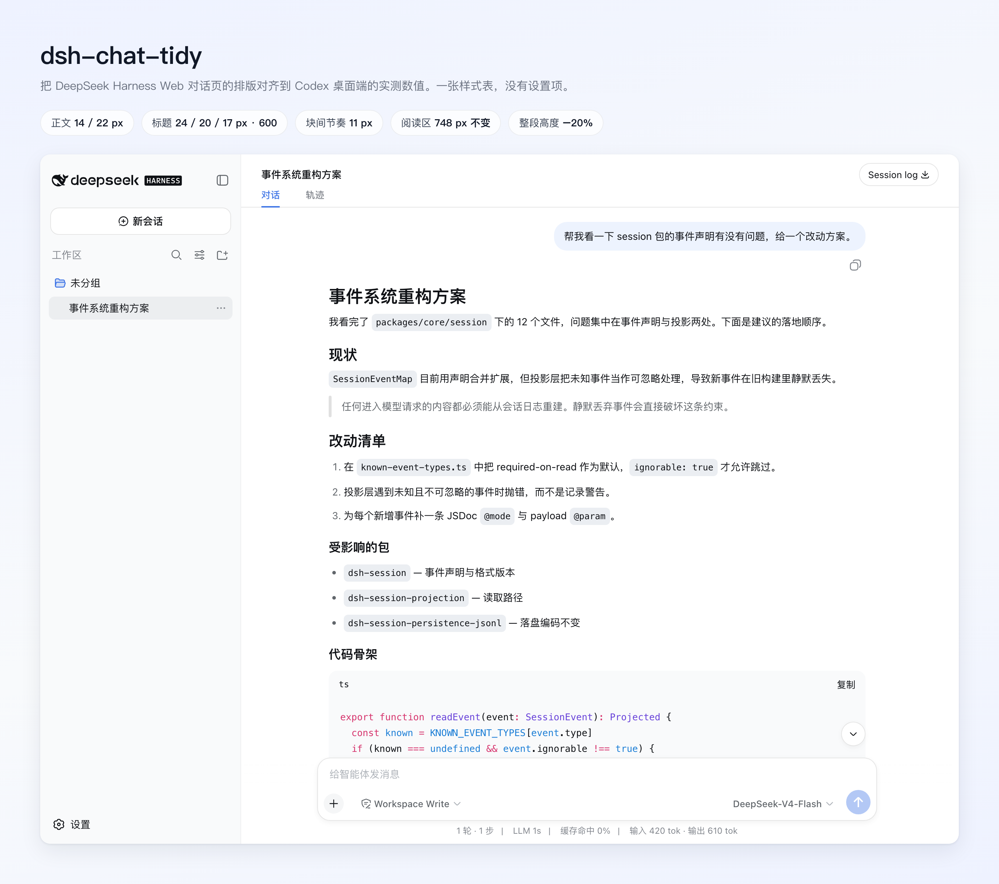
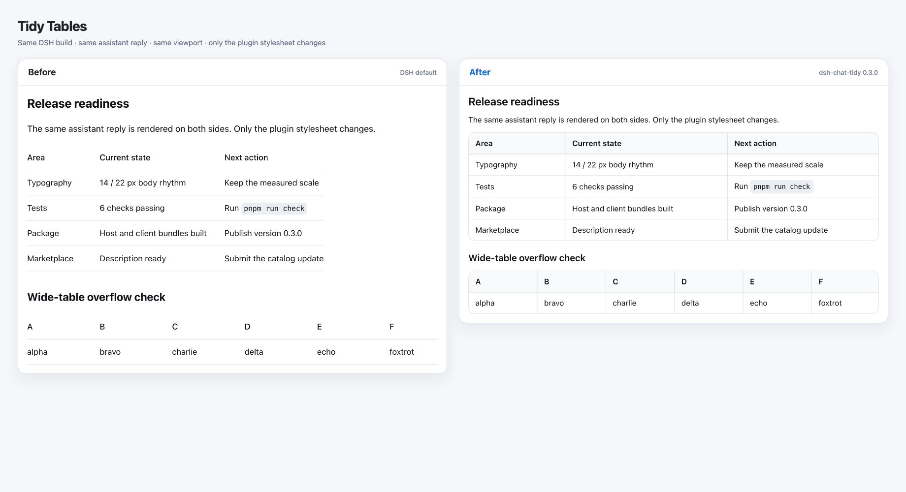
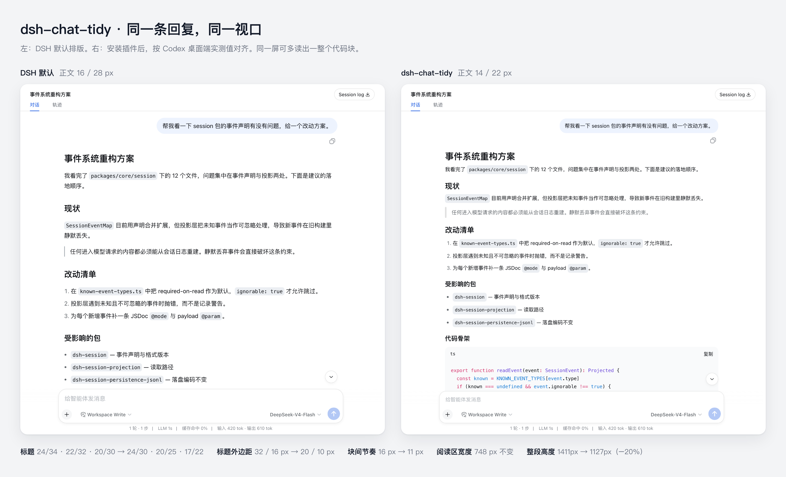
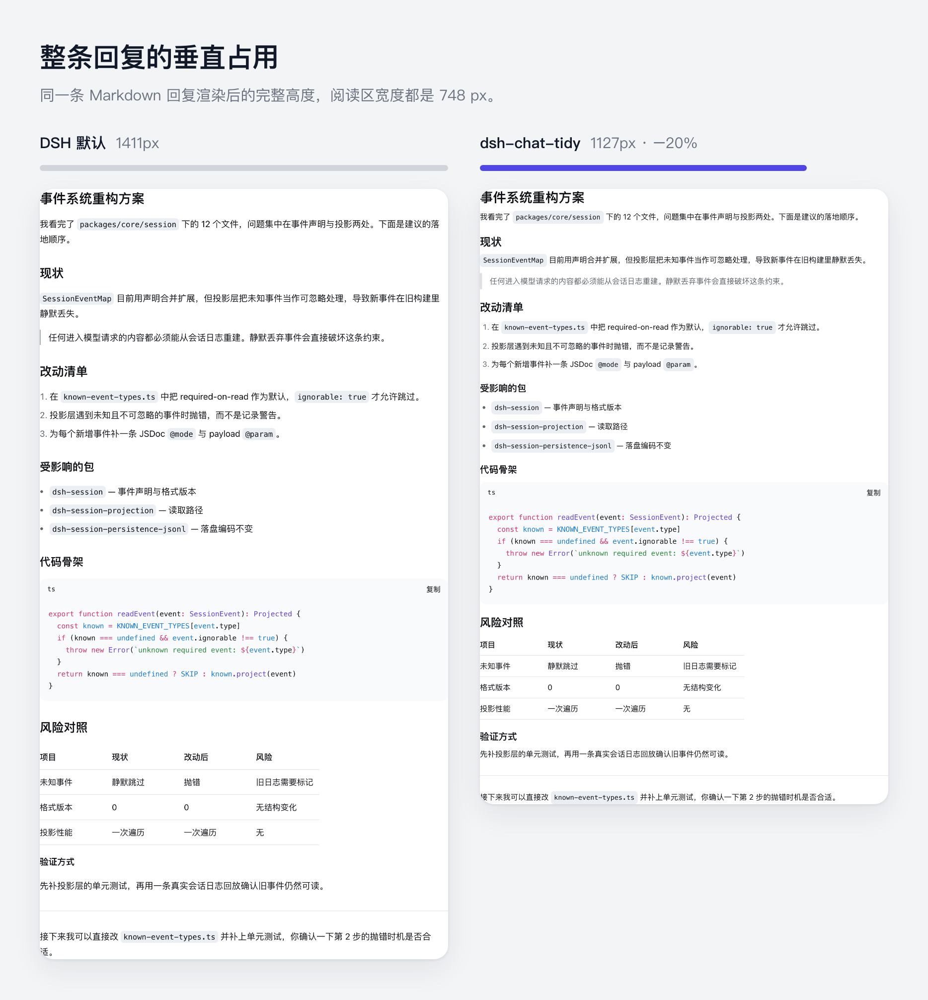
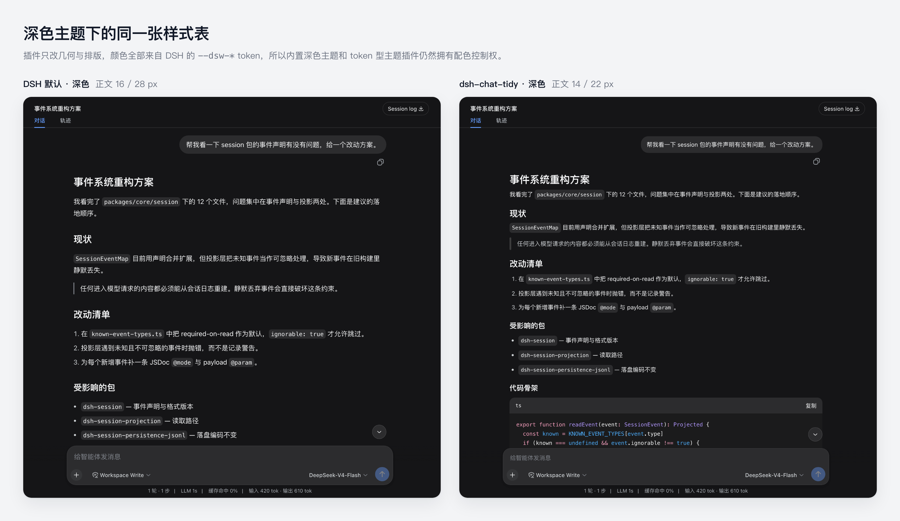
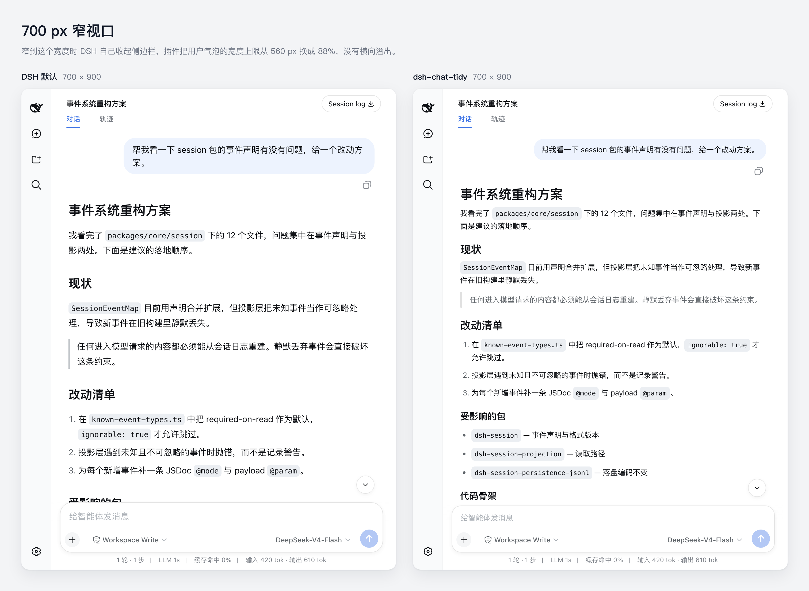

# dsh-chat-tidy

Tidy Chat 让 DeepSeek Harness Web 对话页的阅读节奏对齐成熟的 Coding Agent 客户端。排版与间距从 Codex 桌面端实测得到，再套用到 DSH 自己的聊天锚点上；Tidy Tables 则沿用 DSH 的组件语言，把 Markdown 表格补成完整组件。DSH 原有的 Markdown 渲染、主题、工具调用、推理内容和会话行为都不改动。

[English](README.md)



## 改动明细

| 项目 | DSH 默认 | Tidy Chat（Codex 实测） |
| --- | --- | --- |
| 正文 | 16 / 28 px | **14 / 22 px** |
| h1 – h6 | 24 / 22 / 20 / 16 / 16 / 16 px，字重 700 | **24 / 20 / 17 / 17 / 15 / 15 px，字重 600** |
| 标题外边距 | 上 32 px、下 16 px | **上 20 px、下 10 px** |
| 块间节奏 | 16 px | **11 px** |
| 列表缩进 · 条目间距 | 18 px · 6 px | **21 px · 8 px** |
| 分隔线（`hr`） | 32 px | 28 px |
| 引用块 | 2 px 直角边框 | 圆角 4 px 竖条，缩进 18 px |
| 表格 | 边缘开放；单元格 15 / 25 px，内边距 10 × 16 px | 圆角组件、主题化表头、行列分隔；单元格 14 / 22 px，内边距 8 × 12 px |
| 活动行 | 24 px，标签 14 / 24 px | 22 px，标签 13 / 22 px |

阅读区宽度保持 DSH 原有的 748 px：Codex 实测约 730 px，说明原值本来就是合适的。同时回退了上一版两处过度收紧——列表条目间距回到 8 px，分隔线回到 28 px。


### Tidy Tables

表格不再只是几条开放的横线，而是一个边界完整的组件。外框沿用 DSH 代码块的 12 px 圆角与主题 token；表头使用代码块标题栏的底色和 Codex 实测的 600 字重；较短的表格铺满阅读区，较宽的表格保留横向滚动。插件不会改写表格内容和对齐方式。



### 前后对比

两张对比图都在真实装配的 Web 应用中、用同一个预置会话、同一视口尺寸和同一缩放比例截取，两侧唯一的差别就是这张插件样式表。



同一条回复完整渲染，默认高 1411 px，启用 Tidy Chat 后为 1127 px——同样的内容少滚 20%。



## 设计边界

Tidy Chat 只是一张样式表：没有设置项、没有档位、不存任何状态；停用或卸载插件就是关闭开关。它不会：

- 重新解析或清洗 Markdown；
- 替换 `conversation.chat.node` 渲染器；
- 隐藏推理、上下文注入或工具调用；
- 使用 MutationObserver 改写 React DOM；
- 修改模型输出、会话日志或 Host 数据。

选择器只使用 DSH 语义锚点（`data-chat-flow`、`data-chat-flow-kind`、`data-slot`、`data-disclosure-row`、`data-composer-card`、`data-turn-tail`、`data-time-hover-root`），绝不依赖生成的 CSS Module 类名。每条规则都带前导 `body`，因此无论样式表插入顺序如何，都能压过同优先级的模块默认值。颜色继续使用 `--dsw-*` token，内置主题和 token 型主题插件仍然拥有配色控制权。表格外框依靠这些语义锚点下方稳定的渲染结构定位，不使用它的生成类名。实测与组件设计记录见 [DESIGN.md](DESIGN.md)。

## 安装

```sh
dsh plugin --profile web add github:ChuanTianML/dsh-chat-tidy
```

重启 `dsh web` 即生效。

GitHub 仓库已经包含校验过的 Host 与 Client 构建产物，安装时不需要执行依赖构建脚本，也不需要修改 pnpm 的 `allowBuilds` 策略。

本地开发安装：

```sh
dsh plugin --profile web add -w /absolute/path/to/dsh-chat-tidy
```

Web profile 本身是 pnpm workspace 根目录，因此本地路径安装需要 `-w`。

## 兼容性

- **DSH 内置浅色/深色主题：**支持。
- **dsh-skin：**兼容；Tidy Chat 负责几何与排版，dsh-skin 负责颜色。
- **dsh-ux：**两个插件都会修改聊天字号和流间距，建议只启用其中一个布局插件，以免规则竞争。
- **其他对话视图：**只有复用 DSH 语义 chat-flow 锚点的视图才会应用 Tidy Chat 样式。

颜色一律来自宿主，所以深色主题下变化的只有几何与排版：



窄到 700 CSS px 时 DSH 会自行收起侧边栏，用户气泡宽度上限回落到 88%，没有横向溢出：



当前版本面向 DSH `>=0.1.0-rc.6`。如果未来 DSH 删除某个语义锚点，对应规则会自然失效，不会阻断页面渲染。

## 开发与验证

需要 Node `^22.19` 或 `>=24`，以及 pnpm 11。

```sh
pnpm install
pnpm run check
pnpm run pack:check
```

`pnpm run check` 会执行严格类型检查、ESLint、Vitest、Host/Client 双端构建与生成产物新鲜度检查。测试覆盖样式引用计数、锚点与优先级约束、稳定表格外框定位、表格组件规则，以及完整卸载清理。

浏览器实测结果见 [VALIDATION.md](VALIDATION.md)。

## 隐私与安全

插件不会发起网络请求，也不保存任何数据。安全问题请按 [SECURITY.md](SECURITY.md) 的方式报告。

## 许可证

MIT
